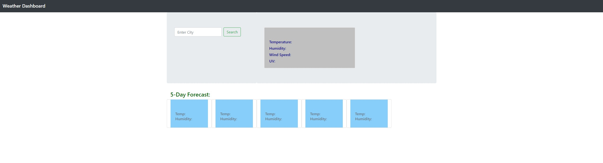
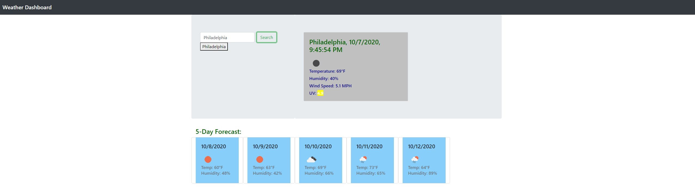

# Weather-Dashboard
This is a weather apllication that allows the user to search for the weather conditions of any city in the world. This app run in the browser and feature by dynamically updated HTML CSS powered by jQuery.

[View the deployed web application.](https://bryu0116.github.io/Weather-Dashboard/)

## Screenshot

